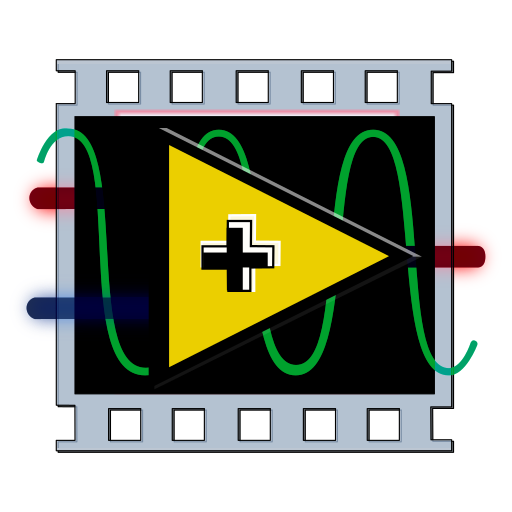
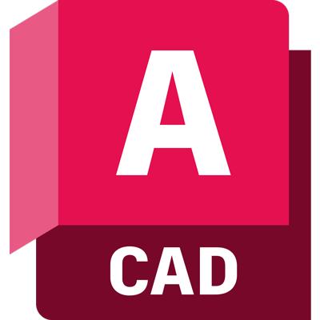

<h1 align="center">
Alessandro Cantone 📚🚀  
Aerospace Systems Engineering Student
</h1>

### About Me:
Aerospace Systems Engineering student with a strong interest in electronics and the design of aerospace systems. Passionate about automation, data analysis, and control systems. 

I am currently developing my skills through academic projects, aiming to contribute to innovative solutions in the aerospace and electronics sectors.

### Languages:
- Native Italian  
- English (B2)

### Tools & Technologies:

  <!-- Arduino -->
  

  <!-- C -->
  

  <!-- C++ -->
  

  <!-- Python -->
  

  <!-- JavaScript -->
  

  <!-- Overleaf -->
  

  <!-- Matlab -->
  

  <!-- LTspice -->
  

  <!-- Multisim -->
  

  <!-- LabVIEW -->
  

  <!-- EasyEDA -->
  

  <!-- CST -->
  

  <!-- AutoCAD -->
  

  <!-- Fusion360 -->
  

  <!-- SolidWorks -->
  

